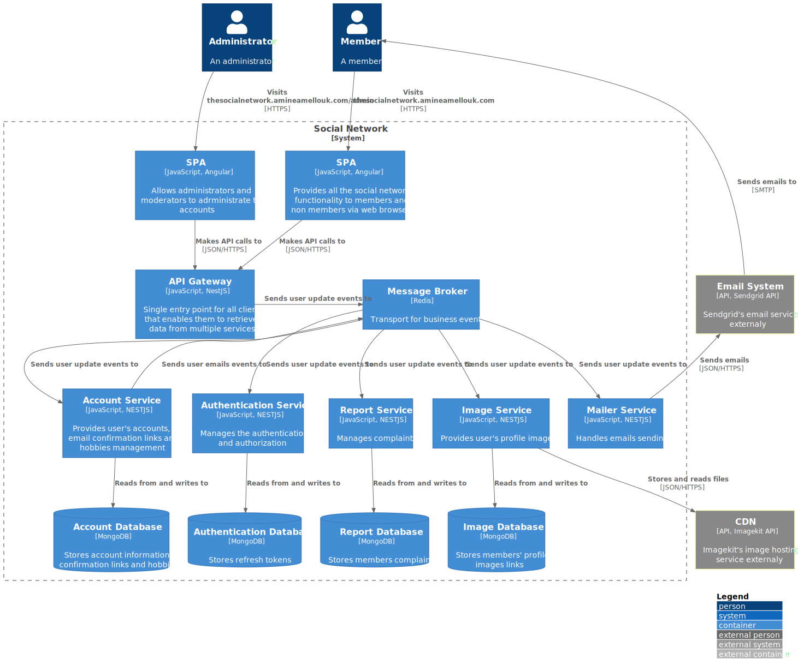

<h1 align="center">
  <br>
  <a href="http://thesocialnetwork.amineamellouk.com" target="_blank"></a>
  <br>
  The Social Network
  <br>
</h1>

<h4 align="center">A social media network aimed to connect people with similar hobbies.</h4>

<p align="center">
  <a href="#folder-structure">Folder Structure</a> •
  <a href="#etymology">Etymology</a> •
  <a href="#key-features">Key Features</a> •
  <a href="#how-to-use">How To Use</a> •
  <a href="#api">API</a> •
  <a href="#credits">Credits</a> •
  <a href="#architecture-diagram">Architecture Diagram</a> •
  <a href="#license">License</a>
</p>

<!-- Better gif video -->


## Folder Structure

    .
    ├── .github/workflows
    ├── backend                      # Nest JS Microservices, MongoDB, Redis and Docker server folder
    ├── client                       # Angular workspace includes projects of users website and admins website folder
    ├── postman                      # All Api documentation
    ├── .gitignore
    ├── LICENSE
    ├── README.md
    ├── docker-compose.prod.yml
    ├── logo.png
    └── package.json

## Etymology
The naming is inspired from the movie [The Social Network (2010)](https://www.imdb.com/title/tt1285016/), it has nothing to do if I liked it or not, it just when I was looking for a name for this project I was like "this a networking website and there's a movie of this theme thus why not"

## Key Features
* JWT token authentication (access token store in memory, and refresh token store in cookie)
* Contact us
* Email verification and welcome on verification
* Auto refresh JWT before it expires
* Upload profile images to a CDN
* Change password
* Edit profile
* Delete account
* View profile
* Role based authorization
* Form validation
* Proteced route navigation from unsaved form
* Microservices architecture
* Container presentation pattern
* Docker compose integration for local development and production
* Password hashing
* Login/register
* Nginx configured for Angular routing
* Let's Encrypt HTTPS certificates with Certbot
* GitHub actions for CI/CD
* Pagination

## How To Use

### Developing

#### Clone Project

To clone and use this application, you'll need [Git](https://www.git-scm.com) and [Node.js](https://www.nodejs.org/en/download) (which comes with [npm](https://www.npmjs.com/)) installed on your computer. From your command line:

```bash
# Clone this repository
$ git clone https://github.com/AmineAML/TheSocialNetwork.git
```

#### Configuration

An example of environments variables do exist in [/backend](https://github.com/AmineAML/TheSocialNetwork/blob/main/backend) folder as `.env.example`, change the name to `.env` and set them up for development

#### Docker

Nest JS depends on MongoDB as a database and Redis for communication between it microservices running from Docker containers started by a docker-compose.yml file

```bash
# Go into the repository
$ cd TheSocialNetwork

# Go into the backend folder
$ cd backend

# Start the containers
$ npm run docker:up
```

#### Nest JS Project

To run the backend side, you'll need [NestJS CLI](https://docs.nestjs.com/cli/overview)

```bash
# Go into the repository
$ cd TheSocialNetwork

# Nestjs app
$ cd backend

# Install dependencies
npm install

# Run the API gateway and all of the microservices
npm run start:dev:all
```

#### Angular Project

To run the client side, you'll need [Angular CLI](https://cli.angular.io/)

```bash
# Go into the repository
$ cd TheSocialNetwork

# Angular app
$ cd client

# Install dependencies
npm install

# Run the site app
ng serve site
```

* Note: you must edit `proxy.conf.json` with your api port

### Deploying

This stack can be adjusted and used with several deployment options that are compatible with Docker Compose, but it's designed to be used in a Linux server with pure Docker, a Nginx reverse proxy and handling HTTPS certificates with Certbot

Main steps involves, starting an Nginx Docker Container and making it part of a network (this is important, you can check the `docker-compose.prod.yml` we added all containers in a network named "production"), then making nginx configuration file to redirect request with your domain to the Angular app container

The other step, is to configure the `nginx.conf` which you could find in `/client` folder, this handles each request redirected from the reverse proxy to the container to again redirect those pointing to the api into the api-gateway, then you can set up your GitHub Secrets, add your server to the self-hosted runners (which both you can find them respectively under your repository's settings as Actions and Secrets) and configure your GitHub workflow to build and deploy the app

We are using [MongoDB Atlas](https://www.mongodb.com/cloud/atlas), and install Docker and Docker Compose on your server

## API
You can find a Postman file of a collection with all API endpoint in [postman](https://github.com/AmineAML/TheSocialNetwork/blob/main/postman) folder, here is an overview of all API endpoints

#### Accounts

Method|URL|Description
------|---|-----------
GET|/api/v1/users/user/id/:id|User data by id
GET|/api/v1/users/user/username/:username|User data by username
GET|/api/v1/users/user|Authenticated user data
GET|/api/v1/users/query?search_term=:hobby|Search by query (optional: page and limit)
GET|/api/v1/users/confirm/:auto_generated_string|Confirm new email
GET|/api/v1/users/interests|All interests sorted by popularity
POST|/api/v1/users/user|Add new user
POST|/api/v1/users/login|Login
POST|/api/v1/users/refresh_token|Refresh access token
PUT|/api/v1/users/user/:id|Update user
PUT|/api/v1/users/logout|Logout
PUT|/api/v1/users/confirm/email|Resend email confirmation
PUT|/api/v1/users/user/change/password|Change password
DELETE|/api/v1/users/user/:id|Account removal

#### Images

Method|URL|Description
------|---|-----------
GET|/api/v1/images/image/:id|All user profile images
POST|/api/v1/images/image/upload|Upload profle image
DELETE|/api/v1/images/image/:id|Image removal

#### Reports

Method|URL|Description
------|---|-----------
GET|/api/v1/reports/report/:id|report by its id
GET|/api/v1/reports|All reports
POST|/api/v1/reports/report|Add new report
PUT|/api/v1/reports/report/:id|Modify report

#### Mailer

Method|URL|Description
------|---|-----------
POST|/api/v1/mailer/contact|Submit contact us email

## Credits
This software uses the following open source packages/frameworks:
- [Node.js](https://nodejs.org/en/)
- [Angular](https://angular.io/)
- [ngneat Tailwind](https://github.com/ngneat/tailwind)
- [RxJs](https://www.npmjs.com/package/rxjs)
- [NestJS](https://nestjs.com/)
- [Bcrypt](https://www.npmjs.com/package/bcrypt)
- [Mongoose](https://mongoosejs.com/)
- [Cookie-parser](https://www.npmjs.com/package/cookie-parser)

And:
- Mailing by [Sendgrid](https://sendgrid.com/)
- Image CDN by [Imagekit](https://imagekit.io/)
- Authentication by [JWT](https://jwt.io/)
- Illustrations by [unDraw](https://undraw.co/)
- Icons by [Font Awesome](https://fontawesome.com/)

Also:
- [Docker](https://www.docker.com/)
- Database by [MongoDB](https://www.mongodb.com/)
- Microservices communication by [Redis](https://redis.io/)
- Reverse proxy by [Nginx](https://www.nginx.com/)
- [Certbot](https://certbot.eff.org/)
- CI/CD by [GitHub Actions](https://github.com/features/actions)
- Server by [OCI](https://www.oracle.com/cloud/)
- DNS [Netlify](https://www.netlify.com/)
- [Postman](https://www.postman.com/)

## Architecture diagram


C4 Model Diagram

## License
This software is licensed under the [MIT](https://github.com/AmineAML/TheSocialNetwork/blob/main/LICENSE) © [Amine AMELLOUK](https://www.amineamellouk.com)

> [amineamellouk.com](https://www.amineamellouk.com) &nbsp;&middot;&nbsp;
GitHub [AmineAML](https://github.com/AmineAML) &nbsp;&middot;&nbsp;
LinkedIn [amine-amellouk](https://linkedin.com/in/amine-amellouk)