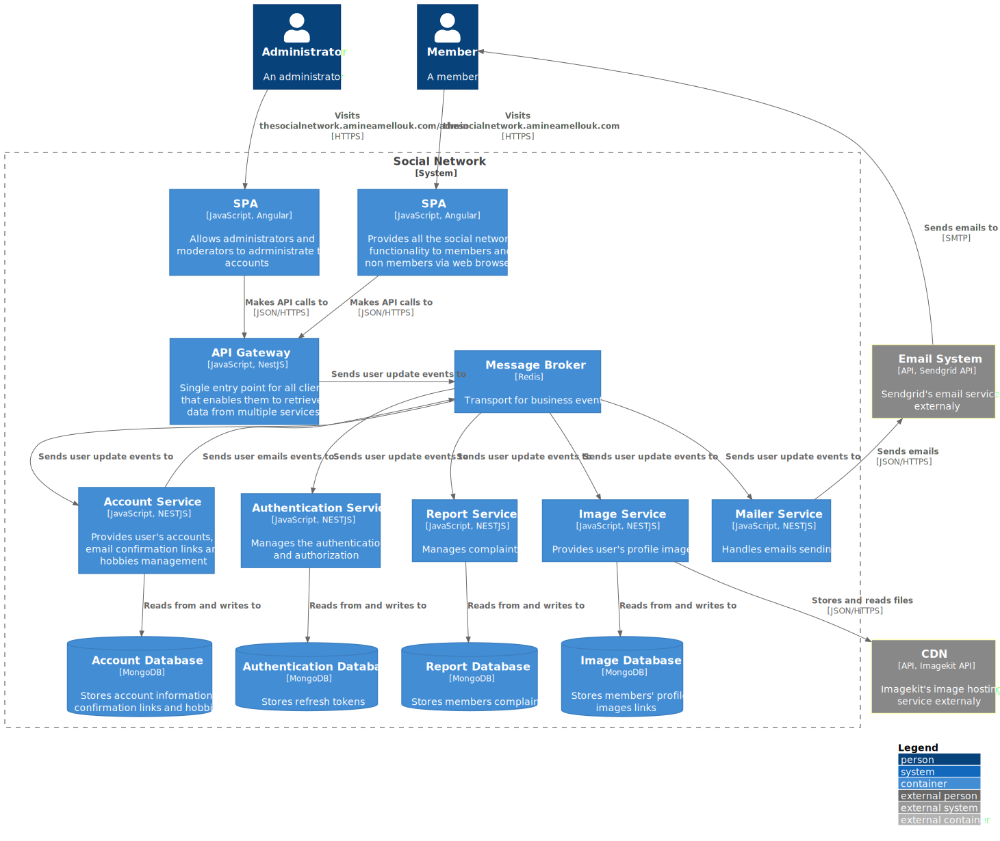

# The Social Network System Design Document

## Project Overview

This document is about building and deploying an application to a remote server, although this talk's specific to Full-Stack applications it's valid for others.

## Motivation

This project is part of the process of learning to build industry standard applications, the goal is to build a fully functional, client ready app. Not only that but through learning and applying the best practices towards a secure and maintainable code.

It's important to mention, that the UI (User Interface) is not part of the overall vision of the app, although it's a point of discussion, it's given a minimum concern and executed according to popular design of some of the most known websites.

The main focus of this document is that of the Back-End and DevOps, in this sense, a lot of effort is on these topics in order to align our goals of functional and maintainable code.

We could go with any idea, and many ideas does and others require this sort of approach we are discussing. Thinking of propositions we settled on building a social network driven to connect people by their hobbies.

The following sections discuss the options, the building and deploying the app:

### Front-End

To understand our requirements, we should first specify what does our app offer to its clients, speaking of which in this section we have to ask ourselves what does our client facing app offer and what are its limitations and abilities.

To answer these, here are a list of what the client is allowed to do with the app:

- Anyone can lookup a user profile, and we know that anything involving privacy and personal data requires protection, in this case it's a protection of creation, modification and deletion of personal information.
This requires from us a system of authentication to sign up, sign in and sign out and only they have access to edit their data, while others have access to view.
- A social network is built on its members' base, this means we can't have people allowed to access data without making an account, thus to encourage them and to attract new members, the app is a membership only.
This requires an authorization system to block any unwanted access to specific routes.
- Understanding that not all members do have access to a fast internet connection speed, an issue arise regarding uploading files. Though our app has default avatars and background images for members who choose so, others still have the option to upload theirs. For fast internet speeds, an image can be uploaded without delay and seamlessly, while for other speeds this can take some time, and here is the problem where the member has to wait in front a blank screen waiting for an image to be uploaded.
This requires as part of the UX (User Experience) a view to let the member knows how much was uploaded, whenever the new image is ready and do display it without a refresh of the page, a usual solution is a progress bar, a loading spinner or text indicating the percentage of the upload.
- As any social network, or business in general, providing support is a must for members and non members.
This requires a contact form accessed publicly.
- Hobbies could be diverse, random and variants, thus members should have an easy way finding potential friends without the need to scrool over a list of people who have hobbies that are of no interest to a member.
This requires a search mechanism with a search bar and auto complete.
- Part of the best security practices, members are allowed to and encouraged to change their passwords periodically.
This requires a system to garante safe modification of this sensitive data by a form, validation and error handling.
- It's a problem that other social networks have an issue with, accounts that are not confirming to the terms new members agree on signing up to the platform, some of these accounts may slip from any verification system that can be utilized, thus it's a common practice that members are encouraged to report these accounts.
This requires the implementation of an option to report members.

All of the above points discuss the means and uses of information available to the public and the members, and as this requires authorization, other data is protected, or better to say other privileges are protected. In this case we are speaking of moderation, which involves protected views and permissions available to the moderators' team.

This list helps to have a picture of what can a moderator do with the app:

- Accounts that appear to receive a lot of reports could be blocked according if the terms of use require that.
- Accounts that are in direct confrontation and not aligned by nor respecting the terms of use are deleted and emails blocked.
- Moderators have access to all the members' informations except from password, and the autorization to block them, delete their accounts or contacting them by email as they see fit and according to the privacy policy.

Tools:
- Framework: Angular
- State Management: RxJs
- CSS Framework: Tailwind CSS
- CSS Components: Angular Material
- Illustrations: UnDraw
- Icons: Font Awesome

### Back-End

It's important to understand, that the whole idea of starting this project is to learn building applications according to the Microservices Architecture.

A microservice is a fully independant service that usually has only one work part of the system, think of it like an API of which each of its services are in a seperate application and work together through a connection.

I would like to direct the attention into a point being of, the separation of concern is a concept that I value. Having said that, I've thought of doing an API for each service, think of an authentication API and a data API, but the Microservices Architecture solves this issue.

The server side code is not about only why it's architecture, it's about securing our credentials including but not limited to tokens, API keys and also handling requests that can't or are not best to be handled on the client side.

We list below our requirements:

- A social network is a members' hub, it's the people that network and to manage their accounts this requires a service for this work.
- How can we identify a member other than that of managing their sessions on the application and this requires a service for this work.
- A member's profile does display their avatar and background images and this requires a service for this work.
- Our application should be able to handle contact emails and this requires a service for this work.
- A good reputation is of the main reasons of the success for a social network, and part of how we garante that is by allowing our members to report inappropriate content, it's better managed independantly which requires a service for this work.
- The services can't be accessed by the client externally and they require a gateway for HTTP communication.

#### Architecture


C4 Model Diagram

#### Database

In choosing the database we have two propositions:

- SQL: PostgreSQL.
- No-SQL: MongoDB.

I would like to point that we had no prior experience with Postgres, although similar ones in the world of SQLs which are MS SQL Server and MySQL. And for explaining why these choices, those are pretty common in applications' tech stack, which indicate why we haven't opted for something else like a SQL from the examples.

MongoDB is a good option for prototyping a minimum valuable product (MVP), getting started and to mention also we had experience with it from other projects.

#### Communication

On the NestJS documentation there exist many tools for the microservices and the gateway to connect between each other, we opted to use Redis as of having experience with it being used for caching in another project and it would make a good choice if we would like to hopefully implement server side caching.

#### Authentication

Speaking of this topic, two main approaches are common in the industry which are:

- Sessions.
- JSON Web Token (JWT) tokens.

Both have it pros and cons, for Sessions are not stateless, meaning they're stored on a database or in cache, in this way once deleted the user has no more access to the application, but the drawback comes from that delay in response that the server has to do verifying.

JWT tokens doesn't require to be stored in a database, they are supposed to be validated on the request by a key, and are timed since you want a sense of validaty in this way the server doesn't have to query the database, and this also comes with a drawback that render a function like logging out a member kinda of a slogan because that token even if deleted and the member redirected off their account, if that token hasn't expired, it can be utilized.

Our approach is to use JWT with a specific implementation:

- Symetric encryption meaning same secret key for encryption and decryption.
- Short-lived access tokens sent in the reponse body from the server and stored in memory on the client side.
- Long-lived refresh tokens sent and stored as a Cookie.

### Emails

Member and non members are contacting through a professional email address made possible by Sendgrid.

### Reverse Proxy

Our application is deployed to a cloud Linuc server instance where all url request are directed to its IP address of x.x.x.x:80 and 80 being the default HTTP port.

This work fine having a single app running in our server machine, but to allow many applications and urls requesting them so that each lands on the intended request, we have to implement a Reverse Proxy.

As with all the previous tech stacks discussed, all have other alternatives. This is no different, and for this project Nginx is a good option.

Our Nginx is been set and running on a Docker container started of the official Docker Hub's Nginx repository.

This is the configuration file for our social network application and it also includes the HTTPS certificate by Let's Encrypt:

```
server {

 server_name <sub domain if any>.<domain>.<tld>;

location / {
 proxy_pass http://container_name:80/;
 proxy_buffering off;
 proxy_set_header X-Real-IP $remote_addr;
}

    listen [::]:443 ssl; # managed by Certbot
    listen 443 ssl; # managed by Certbot
    ssl_certificate /etc/letsencrypt/live/<sub domain if any>.<domain>.<tld>/fullchain.pem; # managed by Certbot
    ssl_certificate_key /etc/letsencrypt/live/<sub domain if any>.<domain>.<tld>/privkey.pem; # managed by Certbot
    include /etc/letsencrypt/options-ssl-nginx.conf; # managed by Certbot
    ssl_dhparam /etc/letsencrypt/ssl-dhparams.pem; # managed by Certbot

}
server {
    if ($host = <sub domain if any>.<domain>.<tld>) {
        return 301 https://$host$request_uri;
    } # managed by Certbot


 listen 80;
 listen [::]:80;

 server_name <sub domain if any>.<domain>.<tld>;
    return 404; # managed by Certbot


}

```

We are also serving our Angular application with Nginx and this is the configuration file:

```
server {	
    listen 80;	
    server_name host.docker.internal;	

    location / {	
            root   /usr/share/nginx/html;	
            index  index.html index.htm;
            try_files $uri $uri/ /index.html;	
    }	

    location /api {	
        proxy_set_header X-Forwarded-Host $host;	
        proxy_set_header X-Forwarded-Server $host;	
        proxy_set_header X-Forwarded-For $proxy_add_x_forwarded_for;
        proxy_pass http://api-gateway:3000;	
    }	
}
```

### Secure URLs by HTTPS

Let's Encrypt is a free and popular HTTPS certificate which can be installed by Certbot.

### Domain name

The domain name amineamellouk.com is registred from namesilo.com, and it's used for my own Portfolio web application.

Although we could register a new domain for this application, we opted for a sub domain with the previously registered domain name thesocialnetwork.amineamellouk.com as a more practical approach for this project.

### DNS

The Domain Name System (DNS) is not managed by the registrar meaning namesilo, rather by Netlify DNS.

This is the configuration for our project:

```
Name: thesocialnetwork
TTL: 3600 seconds
Type: A
Value: the server's IP address
```

### CI/CD

GitHub does offer an amazing Countinous Integration (CI) and Couninous Deploying (CD) pipeline with GitHub Actions, and that we are committing our code to a GitHub repository, there isn't any reason why not to utilize it.

The script allowing for this to work, is a node workflow, although we are using a self hosted which can be set up from the GitHub repository on the section of settings, it's pretty self explinatory.

The workflow is like:

```
name: Node.js CI

on:
  push:
    branches: [ main ]

jobs:
  build_client:
    
    runs-on: ubuntu-latest
    
    strategy:
      matrix:
        node-version: [14.x]
        # See supported Node.js release schedule at https://nodejs.org/en/about/releases/
      
    steps:
    - uses: actions/checkout@v2
    - name: Use Node.js ${{ matrix.node-version }}
      uses: actions/setup-node@v1
      with:
        node-version: ${{ matrix.node-version }}
    - run: sudo npm install -g @angular/cli
    - run: |
        cd client
        npm install
    - run: npm run prod:build:client
    - name: client/dist
      uses: actions/upload-artifact@v2
      with:
        name: client
        path: client/dist
  
  build_backend:
    
    runs-on: ubuntu-latest
    
    strategy:
      matrix:
        node-version: [14.x]
        # See supported Node.js release schedule at https://nodejs.org/en/about/releases/
      
    steps:
    - uses: actions/checkout@v2
    - name: Use Node.js ${{ matrix.node-version }}
      uses: actions/setup-node@v1
      with:
        node-version: ${{ matrix.node-version }}
    - run: sudo npm install -g @nestjs/cli
    - run: |
        cd backend
        npm install
    - run: npm run prod:build:backend
    - name: backend/dist
      uses: actions/upload-artifact@v2
      with:
        name: backend
        path: backend/dist
  
  build:
    needs: 
      - build_client
      - build_backend
    runs-on: self-hosted

    strategy:
      matrix:
        node-version: [14.x]
        # See supported Node.js release schedule at https://nodejs.org/en/about/releases/

    steps:
    - uses: actions/checkout@v2
    - name: Use Node.js ${{ matrix.node-version }}
      uses: actions/setup-node@v1
      with:
        node-version: ${{ matrix.node-version }}
    - name: Create env file
      run: |
        cd backend
        touch .env
        echo MONGO_ACCOUNT_PROD=${{ secrets.MONGO_ACCOUNT_PROD }} >> .env
        echo MONGO_REPORTS_PROD=${{ secrets.MONGO_REPORTS_PROD }} >> .env
        echo MONGO_IMAGE_PROD=${{ secrets.MONGO_IMAGE_PROD }} >> .env
        echo MONGO_AUTH_PROD=${{ secrets.MONGO_AUTH_PROD }} >> .env
        echo REDIS_PROD=${{ secrets.REDIS_PROD }} >> .env
        echo JWT_ACCESS_TOKEN_SECRET=${{ secrets.JWT_ACCESS_TOKEN_SECRET }} >> .env
        echo JWT_REFRESH_TOKEN_SECRET=${{ secrets.JWT_REFRESH_TOKEN_SECRET }} >> .env
        echo IMAGEKIT_PUBLIC_KEY=${{ secrets.IMAGEKIT_PUBLIC_KEY }} >> .env
        echo IMAGEKIT_PRIVATE_KEY=${{ secrets.IMAGEKIT_PRIVATE_KEY }} >> .env
        echo IMAGEKIT_URL_ENDPOINT=${{ secrets.IMAGEKIT_URL_ENDPOINT }} >> .env
        echo APP_NAME=${{ secrets.APP_NAME }} >> .env
        echo BASE_URL=${{ secrets.BASE_URL }} >> .env
        echo ENABLE_MAILER=${{ secrets.ENABLE_MAILER }} >> .env
        echo BCRYPT_SALT_ROUNDS=${{ secrets.BCRYPT_SALT_ROUNDS }} >> .env
        echo API_GATEWAY_PORT=${{ secrets.API_GATEWAY_PORT }} >> .env
        echo SENDGRID_API_KEY=${{ secrets.SENDGRID_API_KEY }} >> .env
        echo CONTACT_EMAIL=${{ secrets.CONTACT_EMAIL }} >> .env
        echo APP_EMAIL=${{ secrets.APP_EMAIL }} >> .env
        cat .env
    - run: npm run docker:down
    - run: docker image prune -a -f
    - run: |
        cd client
        mkdir dist
    - run: |
        cd backend
        mkdir dist
    - name: Download dist from build_client
      uses: actions/download-artifact@v2
      with:
        name: client
        path: client/dist
    - name: Download dist from build_backend
      uses: actions/download-artifact@v2
      with:
        name: backend
        path: backend/dist
    - run: npm run prod
    - run: docker image prune -a -f
```

### DevOps

The production application is running from an Ubuntu server and the build is managed by Docker Compose.

Requirements are Docker and Docker Compose installed on the server, and GitHub Actions handle the production.

## Results

We have went beyond the initial requirements, implementing extra features and changing others to ensure a smooth development and the release of a functional MVP.

## Alternatives

* Database:

Into a couple of weeks in the development, we opted to switch to PostgreSQL to benefit from the built in relationship between tables, as opposed to the NoSQL database MongoDB which offered a better prototyping of this project.

* State Management:

We are using services and RxJs with Angular to manage our app state, although for complex applications a state management library like Akita is a good alternative.

* Project Structure:

The project is structured in a monolithic approach, where both the Front-End and the Back-End are in the same folder, and both are workspaces, meaning each is composed with projects, and in each workspace the applications shares the same configuration, package.json file and node modules and a better approach is utilizing NX.

## Considerations

This project is not perfect as anything else in the world, and as a means to improve it by implementing:

- Integration Testing.

- Unit Tests.

- End 2 End Testing.

- Better User Interfaces.

- This project wasn't aimed to people to chat in the application, but rather to find each other social media profiles, thus it's nice feature building a chat system.

- Accessibilty.

- Improving the security of the server side code.

Refrences:

- NestJS documentation

- Tailwind CSS documentation and YouTube channel

- C4 Model for architecture diagram official website

A thank you to these people for that their projects are of inspiration, help and good teaching material:

- Dan Wahlin

- Brian Johnson

- Kelvin Mai

- Thomas Oliver

- Marcin Wanago

- And many more from dev.to, medium, stack overflow blogs' arcticles, answers and good advice, etc..